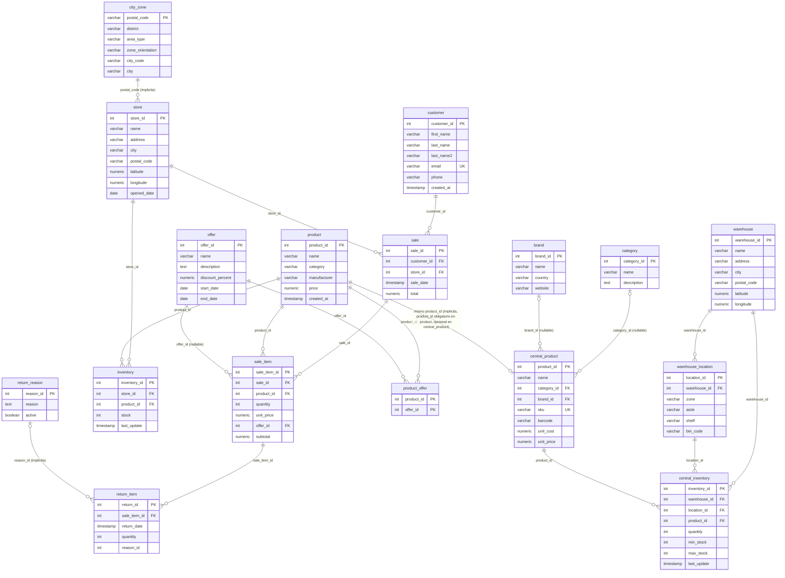

# Diagrama Entidad-Relación — saleshealth (schema public)

**Fase 2 — Modelo Operacional**  
Generado: 2026-05-07  
Base: exploración Pasadas 1-2 + limpieza Fase 1

---

## Convención del diagrama

| Elemento | Significado |
|----------|-------------|
| Línea con etiqueta normal | FK **declarada** con `CONSTRAINT … FOREIGN KEY` |
| Etiqueta con `(implicita)` | Relación semántica **sin constraint declarada** |
| `PK` / `UK` / `FK` en columna | Clave primaria / índice único / clave foránea |

---

## Diagrama Mermaid

---

## Mapeo conceptual — Sistema fuente por tabla

Clasificación en **4 sistemas** según el enunciado del proyecto (ERP / CRM / Logística / Postventa).
Los módulos internos (catálogo maestro, promociones, WMS, geodatos) se anotan como submódulos del sistema correspondiente, no como sistemas independientes.

| Tabla | Sistema | Módulo | Justificación |
|:------|:--------|:-------|:--------------|
| `sale` | **ERP** | Transaccional | Cabecera de transacción de venta; `total` es campo derivado (fuente de verdad: `sale_item.subtotal`) |
| `sale_item` | **ERP** | Transaccional | Línea de detalle; fuente de verdad económica del pedido; target de devoluciones |
| `store` | **ERP** | Transaccional | Maestro de tiendas; conecta la venta con la geografía vía `postal_code` |
| `product` | **ERP** | Catálogo operacional | FK target de `sale_item`; atributos planos (category/manufacturer como varchar, sin normalizar) |
| `central_product` | **ERP** | Catálogo maestro | Mismos productos que `product` pero enriquecidos: `unit_cost`, `sku`, FKs normalizadas a `brand` y `category` |
| `brand` | **ERP** | Catálogo maestro | Maestro de marcas; solo referenciado desde `central_product` |
| `category` | **ERP** | Catálogo maestro | Taxonomía de 6 categorías; solo referenciada desde `central_product` |
| `offer` | **ERP** | Promociones | Definición de oferta con descuento y vigencia; 1 sola oferta activa en el dataset |
| `product_offer` | **ERP** | Promociones | Tabla pivote N:M `product ↔ offer`; 6 asociaciones vigentes |
| `inventory` | **ERP** | Stock en tienda | Snapshot de stock por tienda (1 fila por store×product); sin histórico → excluida del DWH |
| `customer` | **CRM** | — | Maestro de clientes con datos de contacto (email, teléfono); `created_at` = timestamp de carga (decisión D06) |
| `warehouse` | **Logística** | WMS | Almacén central (1 almacén); nodo raíz del subgrama logístico |
| `warehouse_location` | **Logística** | WMS | Ubicación física (zona/pasillo/estante/bin); 40 ubicaciones en el almacén |
| `central_inventory` | **Logística** | WMS | Snapshot de stock por ubicación de almacén; sin histórico → excluida del DWH |
| `city_zone` | **Logística** | Red geográfica | Códigos postales de Madrid con distrito y tipo de área; vincula tiendas con zonas de demanda |
| `return_item` | **Postventa** | — | Devolución a nivel de ítem de venta; granularidad más fina que `sale` |
| `return_reason` | **Postventa** | — | Catálogo de 6 motivos de devolución; enlace implícito (sin FK declarada) desde `return_item` |

---

## Tablas compartidas o ambiguas

### `product` vs `central_product` — dos módulos del ERP para el mismo catálogo

Ambas tablas describen el mismo universo de 50 productos y comparten el espacio de `product_id`, pero son módulos distintos del ERP con propósito y atributos heterogéneos:

| Aspecto | `product` | `central_product` |
|:--------|:----------|:-----------------|
| Módulo ERP | Catálogo operacional (transaccional) | Catálogo maestro (enriquecido) |
| FK destino de | `sale_item`, `inventory`, `product_offer` | `central_inventory` |
| `category` / `brand` | Varchar plano (desnormalizado) | FK a tablas `category` y `brand` |
| `unit_cost` | No presente | Sí (para cálculo de márgenes) |
| `sku` / `barcode` | No presente | Sí (gestión logística) |
| Vínculo entre ambas | Sin FK declarada — mismo `product_id` por convención |

**Cardinalidad real (1..1 ↔ 0..1):** todo registro en `product` existe obligatoriamente (es FK target de `sale_item`), pero `central_product` puede carecer de entrada para algún `product_id`. Antes de D05 faltaba el producto 29; tras la limpieza la cobertura es 100 %. En el ER se dibuja como `||--o|` (uno-a-cero-o-uno) para reflejar que el enlace es por convención, no por constraint.

**Impacto en el DWH:** `dim_product` unirá ambas tablas con `LEFT JOIN` por `product_id`. La cobertura 100 % post-D05 elimina NULLs en `unit_cost`, crítico para el cálculo de márgenes.

---

### `inventory` vs `central_inventory` — Stock en tienda vs stock en almacén

Ambas son snapshots de inventario en un momento puntual (mismo `last_update` para todas las filas), pero en dominios logísticos distintos:

| Aspecto | `inventory` | `central_inventory` |
|:--------|:------------|:--------------------|
| Sistema fuente | Store Ops | WMS |
| Producto referenciado | `product` | `central_product` |
| Granularidad | Tienda | Ubicación física (zona/pasillo/estante) |
| Snapshot | 2026-04-04 12:31 | 2026-04-04 20:30 |

**Decisión:** ambas tablas quedan **fuera del DWH** por ausencia de histórico (solo hay un snapshot). Se documentan como ampliación futura en el documento técnico.

---

## FKs implícitas — resumen

| Relación | Columna de enlace | Por qué no está declarada |
|:---------|:-----------------|:--------------------------|
| `store` → `city_zone` | `store.postal_code` → `city_zone.postal_code` | La FK geográfica no fue declarada en el DDL; la relación existe en datos (todos los `postal_code` de `store` están en `city_zone`) |
| `return_item` → `return_reason` | `return_item.reason_id` → `return_reason.reason_id` | FK omitida en el DDL; en datos todos los `reason_id` de `return_item` son válidos |
| `product` ↔ `central_product` | `product_id` compartido | No es una FK convencional: son dos catálogos paralelos que comparten el espacio de IDs por diseño del sistema fuente |
