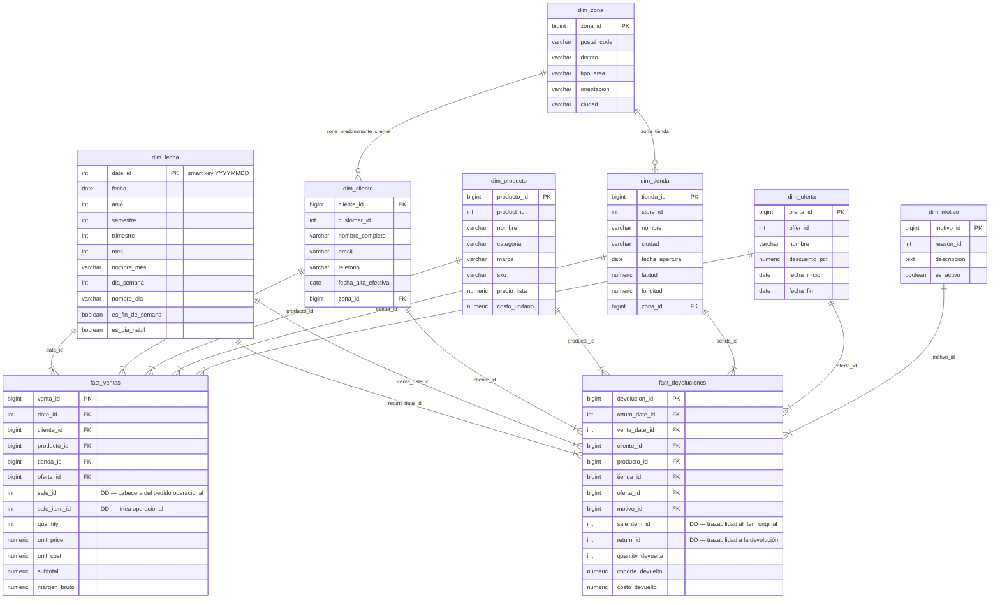

# Esquema estrella — dwh (Kimball)

**Fase 3 — Modelo Dimensional**  
Generado: 2026-05-07  
Basado en decisiones D-M01 a D-M09 (ver tabla al final).

---

## Convención de surrogate keys

| Dimensión | Tipo de SK | Justificación |
|:----------|:----------|:--------------|
| `dim_fecha` | `INT` YYYYMMDD (smart key) | Legible a simple vista en la fact sin JOIN; patrón Kimball estándar para dimensiones de fecha |
| Resto de dimensiones | `BIGINT GENERATED ALWAYS AS IDENTITY` | Sin ventaja de legibilidad directa; BIGINT por escalabilidad |

Las FK en los hechos copian el tipo de la dimensión referenciada: `date_id` es `INT`, el resto `BIGINT`.

---

## Diagrama Mermaid

---

## Notas de diseño

### Sentinel rows

| Dimensión | SK sentinel | NK sentinel | Propósito |
|:----------|:-----------|:-----------|:----------|
| `dim_oferta` | `oferta_id = 0` | `offer_id = -1` | Ítems sin oferta (99,98 % de sale_item) |
| `dim_motivo` | `motivo_id = 0` | `reason_id = -1` | Devoluciones sin motivo registrado (0 casos actuales; sentinel preventivo) |

Con sentinel rows, todas las FK en `fact_ventas` y `fact_devoluciones` son `NOT NULL`.

### dim_producto — desnormalizado (estrella, no snowflake)

`categoria` y `marca` se empotran directamente en `dim_producto` a partir de `central_product → category.name` y `brand.name`. No hay tablas separadas `dim_categoria` ni `dim_marca` — estilo estrella Kimball.

### dim_cliente — derivación de zona_predominante

`zona_id` se calcula en el ETL como la moda del `district` de las compras del cliente, con las reglas:

- **Caso 1** (5.539 clientes): zona = moda única
- **Caso 2** (211 clientes): empate → zona de la primera compra (`MIN(sale_date)`)
- **Caso 3** (0 clientes en datos actuales): empate + misma fecha → menor `postal_code` lexicográfico

### fact_ventas — medidas y margen

`margen_bruto = subtotal − (quantity × unit_cost)`. Se calcula en el ETL (no en consulta) para que `SUM(margen_bruto)` sea aditiva en cualquier nivel de agregación. `unit_cost` proviene de `central_product` en la carga; tras D05 la cobertura es 100 %.

### fact_devoluciones — role-playing de dim_fecha

`fact_devoluciones` referencia `dim_fecha` con dos roles:
- `return_date_id` — cuándo se devolvió el ítem
- `venta_date_id`  — cuándo se vendió el ítem original (JOIN a `public.sale` en el ETL)

En los JOINs analíticos se aliasa la tabla: `JOIN dwh.dim_fecha AS df_venta ON ...` y `JOIN dwh.dim_fecha AS df_dev ON ...`.

### fact_devoluciones — no referencia fact_ventas (Opción A Kimball)

`fact_devoluciones` duplica las FK a todas las dimensiones y mantiene `sale_item_id` como DD de trazabilidad. No hay FK entre hechos (antipatrón Kimball). Ambos hechos son consultables independientemente con el mismo conjunto dimensional.

---

## Orden de carga ETL (Fase 4)

Orden topológico según dependencias entre tablas:

| Paso | Tabla | Depende de | Nota |
|:-----|:------|:-----------|:-----|
| 1 | `dim_fecha` | — | Generada sintéticamente; rango 2020-01-01 → 2027-12-31 |
| 2 | `dim_zona` | `public.city_zone` | Sin FK saliente en DWH |
| 3 | `dim_oferta` | `public.offer` | INSERT sentinel `oferta_id=0` al inicio |
| 4 | `dim_motivo` | `public.return_reason` | INSERT sentinel `motivo_id=0` al inicio |
| 5 | `dim_producto` | `public.central_product`, `public.brand`, `public.category` | Desnormaliza en un solo JOIN |
| 6 | `dim_tienda` | `public.store` + `dim_zona` (paso 2) | Resuelve `zona_id` por `postal_code` |
| 7 | `dim_cliente` | `public.customer` + agregación `sale→store→city_zone` + `dim_zona` (paso 2) | Calcula `zona_predominante_id` con lógica D-M03b |
| 8 | `fact_ventas` | Todas las dimensiones (pasos 1–7) | Carga principal |
| 9 | `fact_devoluciones` | Todas las dimensiones (pasos 1–7) | Paralela con `fact_ventas` si hay concurrencia |

**Notas:**
- `fact_ventas` y `fact_devoluciones` no tienen dependencia entre sí → pueden cargarse en paralelo.
- `dim_cliente` (paso 7) requiere que `dim_zona` esté cargada para resolver `zona_id` de la zona predominante.
- Los pasos 3 y 4 (dim_oferta y dim_motivo) pueden ejecutarse en paralelo entre sí y con dim_zona.

---

## Tabla de decisiones de diseño — Fase 3

| ID | Decisión | Resultado |
|:---|:---------|:----------|
| D-M01 | Granularidad `fact_ventas` | `sale_item` (línea) |
| D-M02 | `fact_devoluciones` | Hecho separado — doble fecha, dimensiones duplicadas |
| D-M03 | `dim_cliente` zona | Moda de `district` vía `sale → store → postal_code → city_zone` |
| D-M03b | Desempate de zona | Caso 1: moda / Caso 2: primera compra / Caso 3: menor `postal_code` |
| D-M04 | `dim_fecha` | 2020-01-01 a 2027-12-31; incluye `es_dia_habil` |
| D-M05 | SCD | Tipo 1 en todas las dimensiones |
| D-M06 | `offer` en DWH | `dim_oferta` propia (1 fila real + sentinel); FK NOT NULL |
| D-M07 | Clientes sin ventas | 0 casos; `dim_cliente` incluye los 5.750 clientes |
| D-M08 | `dim_zona` | Tabla separada; consumida por `dim_tienda` y `dim_cliente` |
| D-M09 | Surrogate keys | `dim_fecha`: INT YYYYMMDD (smart key); resto: BIGINT IDENTITY |
| D-M10 | `reason_id` | Elevado a `dim_motivo` (6 filas + sentinel); FK en `fact_devoluciones` |
| D-M11 | `fact_ventas → dim_zona` | Sin FK directa; zona accesible vía `dim_tienda` (un solo JOIN) |
| D-M12 | `fact_devoluciones ↔ fact_ventas` | Sin FK entre hechos (Opción A Kimball); `sale_item_id` como DD |
